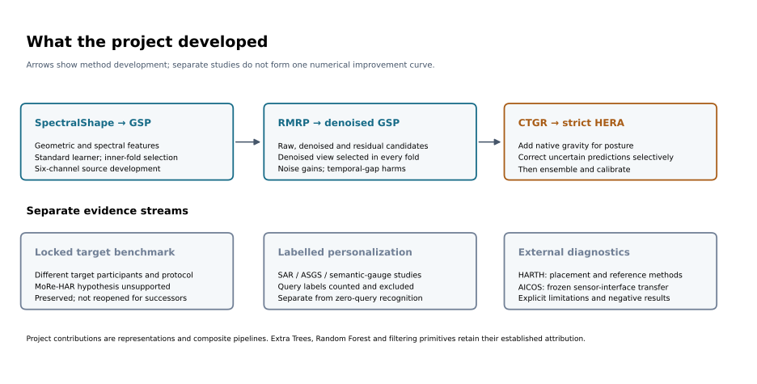
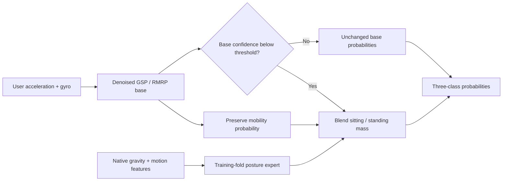
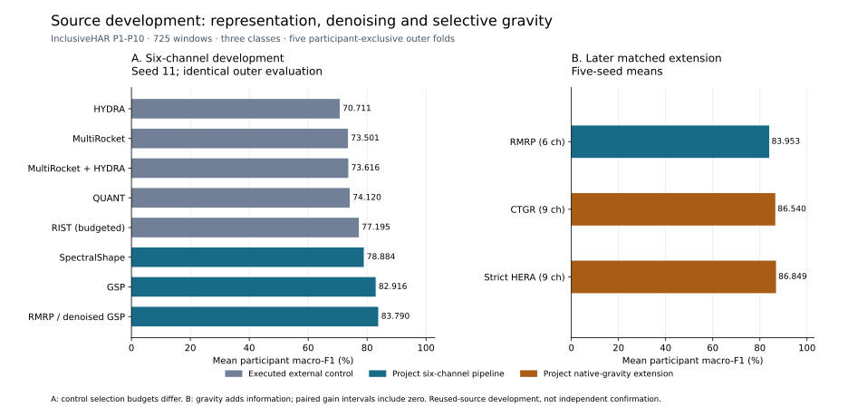

# InclusiveShift-HAR: participant-exclusive activity recognition under sensor and population shift

Research report · 22 September 2026 · Software version 0.1.7a0

## Abstract

InclusiveShift-HAR studies recognition of mobility, sitting, and standing from
wearable inertial signals, with the participant as the unit of evaluation.
The original locked six-channel target evaluation did not support the MoRe-HAR
hypothesis: Compact DANN and Compact CORAL achieved approximately 68.08% mean
participant macro-F1. Subsequent development on ten source participants produced
the project's SpectralShape, Geometric Spectral Pyramid (GSP), and Robust
Multiscale Residual Pyramid (RMRP) feature pipelines. Under the same seed-11
source evaluation, the selected denoised-GSP RMRP reached 83.790% participant
macro-F1, compared with 78.884% for SpectralShape and 77.195% for the tested
budgeted RIST control. These comparisons share participants, windows and outer
folds, but not selection budgets. Confidence-Triggered Gravity Residual (CTGR)
then added native gravity and selective posture correction. Across five matched
seeds, CTGR improved the project's six-channel RMRP from 83.953% to 86.540%. Strict
HERA-CTGR reached 86.849% macro-F1 and 87.228% accuracy, but its incremental
advancement gates failed. On a separate binary HARTH posture diagnostic,
right-thigh rich-feature Random Forest reached 97.261% participant macro-F1
and 99.723% accuracy across five participant-exclusive folds.
External studies exposed substantial placement and sensor-interface effects.
The contribution comprises the development of these feature and combination
methods, matched ablations, and an auditable evaluation framework; independent
superiority remains unestablished.

## 1. Research questions

The experiments address three distinct questions:

1. How well do frozen inertial classifiers transfer to the original held-out
   ability-associated population?
2. Can feature design, denoising, native gravity, and selective posture correction
   improve participant-exclusive source development?
3. Which conclusions survive a change in placement, dataset, or sensor interface?

These questions have different cohorts and input budgets. Results are therefore
reported in separate comparison groups. The [experiment map](research/README.md)
indexes the earlier model families, negative trials, and follow-up studies.

Evaluation design matters in HAR: participant overlap can substantially change
the measured performance, as examined in
[How Validation Methodology Influences Human Activity Recognition Mobile Systems](https://doi.org/10.3390/s22062360).
Cross-dataset evaluation also requires explicit harmonization of units, sampling,
gravity treatment, and labels; the
[DAGHAR benchmark](https://www.nature.com/articles/s41597-024-03951-4) provides a
relevant methodological reference. Neither publication independently validates
the methods in this repository.

## 2. Data and evaluation

### 2.1 InclusiveHAR

The primary source is [InclusiveHAR v4](https://doi.org/10.17632/r78dn3f6nc.4).
The functional endpoint contains mobility, sitting, and standing. Mobility
includes manual wheelchair propulsion where the provider uses the label
`Walking`; it must not be interpreted exclusively as gait.

The original benchmark used six channels: user acceleration and rotation rate.
P1-P10 formed the source cohort, while P11-P20 were opened once under the
[locked protocol](LOCKED_PROTOCOL.md). Subsequent CTGR/HERA development uses only
the ten source participants, with 725 non-overlapping 128-sample windows,
five participant-exclusive outer folds, and four inner folds. The canonical
five-seed comparison uses seeds 11, 23, 47, 89, and 131.

Participants are separated before windowing; preprocessing, weighting, and
candidate selection use training/inner-validation partitions. The release does
not provide recoverable trial or timestamp boundaries. The released-block
protocol is participant-exclusive and raw-row-disjoint, but it cannot establish
trial-safe segmentation. Identity and sensitive metadata are not model inputs.

### 2.2 Metrics and uncertainty

The principal endpoint is mean participant macro-F1: compute macro-F1 separately
for each eligible participant, then average participants equally. Pooled
macro-F1 instead builds one confusion matrix from all scored observations.
Accuracy is the fraction of correctly classified observations. Five-seed source
accuracy is the arithmetic mean of the five per-seed pooled window accuracies;
predictions are not ensembled across seeds. These metrics
weight participants and classes differently and are not interchangeable.

Source results also report the bottom 30% of participants, the worst participant,
class recall, negative log-likelihood (NLL), and multiclass Brier score. Differences
use aligned participant predictions and matched seeds. Participant-bootstrap
intervals are descriptive after repeated development on these people; five
training seeds do not increase the independent sample size beyond ten.

### 2.3 External studies

HARTH supplies lower-back and right-thigh accelerometry from 22 participants.
Its original study describes twelve activities and participant-held-out
evaluation. The binary posture diagnostic uses five participant-exclusive folds
and 13,715 non-overlapping 250-sample windows confined to physical and annotated
label runs. The multiclass replay uses 22 leave-one-participant-out folds,
25,831 complete majority-label windows and sample-level scoring over 6,461,328
samples, including recording tails. It reports twelve classes and a merged
nine-class endpoint. These are separate segmentation and evaluation contracts. See the
[HARTH dataset paper](https://pmc.ncbi.nlm.nih.gov/articles/PMC8659926/) and the
[executed replication protocol](research/HARTH_PUBLISHED_REPLICATION_V1_PROTOCOL.md).

AICOS evaluates source-frozen models using an external smartphone interface.
The latest routing comparison has 38 participants with all three primary classes
and 40,588 primary windows. Acceleration/gravity conversion from SI units to g
was corrected before that comparison. Native versus derived gravity and
unresolved logger axes/polarity still limit interpretation. Both provider splits
are consumed diagnostic evidence.

## 3. Method

### 3.1 Project-developed feature representations

SpectralShape combines robust moments, derivatives, normalized spectra,
autocorrelation, channel correlation and rotation-related features. It is the
project's initial feature pipeline in this source-development sequence; the
[SpectralShape configuration](../configs/experiments/spectral_shape_nested_v1.yaml)
records its candidate set and selection rule. The subsequent Geometric Spectral
Pyramid (GSP) summarizes axis statistics, covariance geometry, rotation-related
scalar features, spectra, and temporal pyramids.
The Robust Multiscale Residual Pyramid (RMRP) evaluated raw, denoised,
trend-residual, and concatenated views. All five original outer folds selected
the denoised GSP view with participant/class-weighted Extra Trees. The selected
model should therefore be described as denoised GSP; residual concatenation was
an evaluated alternative, not the source of the retained improvement.

SpectralShape, GSP and RMRP are project-developed feature and selection methods,
as are the later CTGR/HERA combination procedures. They use established
components, including Extra Trees and Savitzky–Golay filtering. HYDRA,
MultiRocket, QUANT and RIST are external method families implemented as controls;
their authorship is separate from the project's feature pipelines.

The development map distinguishes changes in representation, sensor information
and supervision. Its arrows describe method development, not independent causal
effects or gains that can be added across evaluation protocols.

### 3.2 Confidence-Triggered Gravity Residual

CTGR retains the six-channel base probabilities and adds a posture expert
using three native gravity channels. Its candidate views describe gravity
direction and motion relative to gravity. A confidence threshold and blending
weight, chosen in inner participant folds, determine whether to redistribute
the sitting/standing probability mass.

The mobility probability remains exactly that of the base. Confident base
outputs pass through unchanged. This restricts the intervention to uncertain
posture decisions and avoids replacing a strong mobility model globally.
Both the base and the selected posture expert use standard Extra Trees
classifiers. CTGR's contribution is the feature and conditional combination
procedure, rather than a new tree-learning algorithm.

### 3.3 HERA extension

Strict HERA-CTGR v1 adds top-three CTGR candidate marginalization, posture
calibration, and a gravity-gyroscope consistency veto. Its retained strict mode
uses only the current window. Participant-context controllers, label-informed
oracles, and labelled semantic gauges are separate ablations with distinct
information budgets. The [model card](MODEL_CARD_CTGR_HERA.md) and versioned
protocols specify the implementations.

### 3.4 HARTH feature pipelines and reference methods

The HARTH project pipeline is trained within HARTH participant folds. It combines
axis and norm statistics, covariance geometry, spectra, subwindow summaries and
lag features with a standard Random Forest: 300 trees, minimum leaf size 2,
square-root feature sampling and balanced-subsample class weights. A single
placement has 161 features; concatenating back and thigh gives 322. This is a
separate accelerometer pipeline, not a frozen CTGR/HERA model or a simple learner
substitution within CTGR.

The multiclass replay also executes reference-style SVM, Random Forest and
XGBoost with the declared 161-feature reference view. The RF comparator uses
80 trees, minimum split size 10 and balanced class weights; XGBoost uses 1,024
depth-3 trees; SVM uses an RBF kernel with C=10 and training-only MinMax scaling.
The project/reference comparisons therefore change feature recipes and estimator
settings. Only the placement comparison holds the RF recipe fixed while changing
the measured placement. Exact configurations and filtering are in the
[replay protocol](research/HARTH_PUBLISHED_REPLICATION_V1_PROTOCOL.md).

## 4. Results

### 4.1 Original locked target

This historical six-channel evaluation concerns ten target participants.
It is not an evaluation of the later nine-channel CTGR/HERA models.

| Model | Mean participant macro-F1 (%) | Interpretation |
|---|---:|---|
| Compact DANN | 68.084 | Highest rounded target point estimate |
| Compact CORAL | 68.079 | Effectively tied with DANN |
| MoRe-HAR full | 63.533 | Preregistered hypothesis not supported |

Source: [locked publication report](../results/confirmatory/zero_shot_v1/publication_report_v1.json)
and [participant statistics](../results/confirmatory/zero_shot_v1/participant_statistics.json).
The target cohort is closed to subsequent model selection.

### 4.2 Matched source development

#### 4.2.1 Seed-11 development history

The early source comparison used the same 725 windows, P1-P10, five outer
participant folds and seed 11. Project feature pipelines selected candidates
inside four inner participant folds. External controls used their recorded fixed
configurations, including a budgeted RIST configuration. This is a comparison of
executed recipes, not an equal-search-budget ranking of all method families.

External methods retain their original attribution:
[HYDRA](https://arxiv.org/abs/2203.13652),
[MultiRocket](https://arxiv.org/abs/2102.00457),
[QUANT](https://arxiv.org/abs/2308.00928), and
[RIST](https://ecml-aaltd.github.io/aaltd2023/papers/AALTD_2023_Hybrid_Pipeline.pdf).
The executed aeon configurations are recorded in the
[fixed-control configuration](../configs/experiments/aeon_time_series_controls_v1.yaml);
RIST used 256 intervals and 256 shapelets. These are locally measured results,
not scores copied from those publications.

| Method | Origin and role | Channels | Window accuracy (%) | Participant macro-F1 (%) |
|---|---|---:|---:|---:|
| HYDRA | External control | 6 | 73.517 | 70.711 |
| MultiRocket | External control | 6 | 76.138 | 73.501 |
| MultiRocket + HYDRA | External control combination | 6 | 76.000 | 73.616 |
| QUANT | External control | 6 | 76.966 | 74.120 |
| Budgeted RIST | External control | 6 | 78.759 | 77.195 |
| SpectralShape | Project feature pipeline | 6 | 79.724 | 78.884 |
| GSP | Project geometric/spectral representation | 6 | 83.448 | 82.916 |
| RMRP: selected denoised GSP | Project denoising/view-selection development | 6 | 84.414 | 83.790 |
| CTGR | Project selective gravity correction | 9 | 86.897 | 86.474 |
| Strict HERA-v1 | Project CTGR extension | 9 | **87.034** | **86.755** |

The comparable six-channel development moved from tested controls in the 70s to
project representations in the 80s: RMRP exceeded budgeted RIST by 6.595 macro-F1
points and SpectralShape by 4.906 points. RMRP improved seven participants and
harmed three relative to RIST. The worst-participant score was 61.681% for RIST,
49.850% for GSP and 54.936% for RMRP: the mean improvement was not uniform and did
not establish lower-tail dominance over RIST.

Within the project, denoising added 0.874 points over GSP, with five participant
wins, four harms and one tie. Noise/dropout robustness improved, but contiguous
temporal-gap robustness worsened and the joint advancement gate failed. The
later CTGR/HERA rows additionally use three native gravity channels. Their
larger scores therefore reflect both additional information and its selective
use, not a six-channel architecture-only improvement.

Sources: [audited source lineage](research/SOURCE_DEVELOPMENT_LINEAGE_AUDIT_20260922.md),
[tracked lineage record](../results/research/source_development_lineage_v1.json),
and [original FuSE/ReFrame report](research/FUSE_REFRAME_V2_RESEARCH_REPORT.md).

#### 4.2.2 Five-seed comparison of the retained project methods

All rows below use the same 725 source windows and seeds 11, 23, 47, 89 and 131.
RMRP is the project's own developed predecessor and serves as the matched base
for this later study; it is not an external baseline or the beginning of the
project's contribution.

| Method | Channels | Accuracy (%) | Participant macro-F1 (%) | Bottom 30% (%) | Worst participant (%) | NLL | Brier |
|---|---:|---:|---:|---:|---:|---:|---:|
| RMRP: selected denoised GSP | 6 | 84.579 | 83.953 | 69.941 | 54.767 | 0.36889 | 0.22512 |
| CTGR | 9 | 86.979 | 86.540 | **73.990** | 57.512 | 0.35426 | 0.21165 |
| Strict HERA-v1 | 9 | **87.228** | **86.849** | 73.933 | **58.028** | **0.34038** | **0.20303** |

CTGR gained 2.586 percentage points over RMRP and passed all nine predeclared
development advancement checks. Eight participants improved and two declined.
The descriptive paired interval was approximately [-0.05, +4.89] points.
This comparison changes both the available signal and its use; it is not an
architecture-only effect at equal sensor input.

Strict HERA gained 0.309 points over CTGR, with a descriptive paired interval of
[-0.095, +0.713] points. Its gain and bottom-tail gates failed. The highest point
estimate therefore does not establish a reliable successor.

Sources: [CTGR aggregate](../results/development/max_rnd_secondary_v1_summary.json),
[HERA-v1 aggregate](../results/development/hera_ctgr_retrospective_v1_summary.json)
and [prediction-based metric audit](../results/research/reported_metrics_audit_v1.json).

The figure separates the seed-11 six-channel comparison from the five-seed
RMRP/CTGR/HERA comparison. All scores are participant-mean macro-F1; the panels
must not be combined into a single equal-input, equal-selection-budget estimate.

### 4.3 Fixed source ablation

Round A evaluated all six predeclared flat configurations on the same 725 windows,
ten people, five outer folds and seed 11. CTGR and strict HERA are cached controls,
with window identifiers, labels, participant identifiers and probabilities
checked against the canonical source archive.

| Cell / method | Input and feature path | Window accuracy (%) | Participant macro-F1 (%) |
|---|---|---:|---:|
| A1 Extra Trees | Raw six-channel GSP | 83.034 | 82.659 |
| A2 Extra Trees | Denoised six-channel GSP | 84.000 | 83.393 |
| A3 Extra Trees | Raw GSP + native gravity, nine channels | 81.103 | 76.848 |
| A4 Extra Trees | Denoised GSP + native gravity, nine channels | 82.207 | 78.653 |
| A5 Random Forest | Same features as A4 | 80.000 | 74.576 |
| A6 XGBoost | Same features as A4 | 80.966 | 75.579 |
| CTGR control | Six-channel base + selective gravity expert | 86.897 | 86.474 |
| Strict HERA control | CTGR candidate ensemble, calibration and veto | **87.034** | **86.755** |

Denoising improved both tested flat Extra Trees feature sets. Appending gravity
to the flat representation reduced performance, whereas CTGR used gravity
selectively and exceeded A4 by 7.821 macro-F1 points. Extra Trees was stronger
than the tested RF and XGBoost configurations on the identical A4 features.
Thus, merely replacing the learner or appending more measurements did not
reproduce the structured pipeline's result.

These are single-seed development comparisons. CTGR uses nested selection while
the six flat cells use fixed settings, so this is not a tuning-budget-matched
ranking of estimator families. A2 is also a different fixed recipe from the
canonical RMRP base in Section 4.2; their scores must not be substituted.
All eight rows were independently recomputed in the
[metric audit](research/REPORTED_METRICS_AUDIT_20260920.md).

### 4.4 Mechanism and ablation evidence

| Question | Executed evidence | Supported conclusion |
|---|---|---|
| Does denoising help? | Seed-11 GSP 82.92% versus RMRP 83.79%; residual-containing views were not selected | Denoising was useful; the predeclared joint advancement threshold was not met |
| Is gravity sufficient by itself? | Standalone gravity expert 83.20% versus CTGR 86.54% in the five-seed study | Selective combination outperformed wholesale replacement in this cohort |
| Do later controllers improve HERA? | HERA-v2 86.749%; rescue routing abstained in all 25 outer-fold fits | Calibration benefits did not establish better classification |
| Does compact evidence complement HERA? | Seed-11 compact integration 86.461% versus matched HERA 86.755% | No complementary gain |
| Can one label help? | Active-hard gauge 87.256% versus 86.645% on 715 matched remaining windows | +0.611 points, confined to one participant; labelled personalization only |
| Should the confidence trigger be removed? | Seed-11 U9 minus triggered CTGR: -3.442 points on source | Reject unconditional routing; individual losses reached 35.464 points |
| Is expert complementarity available? | Label-informed HERA oracle 88.618% | Diagnostic headroom, without a deployable label-free selection rule |

These rows span different experiments and cannot be ranked or added together.
The [canonical method status](research/CANONICAL_HERA_CTGR_METHOD_STATUS.md),
[HERA-v2 report](research/HERA_CTGR_V2_RETROSPECTIVE_V1_RESULTS.md),
[gauge report](research/HERA_POSTURE_GAUGE_V1_RESULTS.md), and
[routing validation](research/CTGR_ROUTING_VALIDATION_20260919.md)
identify the corresponding controls and denominators.
The random-hard gauge reached 87.328% on its own 715 remaining windows; a
different query set changes which windows are excluded. Neither gauge result
replaces the full-cohort, zero-query five-seed source comparison.

### 4.5 External transfer and placement

**AICOS, 38 complete participants, three classes, frozen source models:**

| Method | Window accuracy (%) | Mean participant macro-F1 (%) | Sitting recall (%) | Standing recall (%) |
|---|---:|---:|---:|---:|
| Six-channel denoised GSP base (B6) | **76.28** | 67.424 | **64.60** | 62.06 |
| Flat nine-channel Extra Trees (B9) | 68.10 | 64.638 | 34.87 | 69.60 |
| Triggered CTGR (T9) | 76.27 | **68.972** | 57.92 | 69.96 |
| Unconditional posture routing (U9) | 73.31 | 68.926 | 45.13 | **75.60** |

CTGR exceeded B6 by 1.549 macro-F1 points with essentially unchanged accuracy,
and exceeded B9 by 4.334 points. These are descriptive conditional transfer
results; B6 also has a smaller signal budget. All models were fitted on source
data, with no model fit on the external cohort.

U9 minus T9 was -0.046 points, with a descriptive paired interval of
[-1.712, +1.584] points. Standing improved while sitting deteriorated; the bottom
30% declined by 2.367 points. The earlier eight-person favorable result did not
repeat. Source: [fixed routing report](research/CTGR_ROUTING_VALIDATION_20260919.md).

**HARTH, 22 participants, five folds, matched binary sitting/standing diagnostic:**

| Input to rich Random Forest | Window accuracy (%) | Mean participant macro-F1 (%) | Sitting recall (%) | Standing recall (%) |
|---|---:|---:|---:|---:|
| Lower back | 81.291 | 59.037 | 89.515 | 37.413 |
| Right thigh | **99.723** | **97.261** | **99.913** | 98.707 |
| Both placements | 99.672 | 97.198 | **99.913** | 98.383 |
| Back with inner-fold-selected thigh override | 90.222 | 86.263 | 88.571 | **99.030** |

The thigh made 38 errors in 13,715 windows. Its pooled window macro-F1 was
99.477%, while the participant-balanced endpoint was 97.261%. This difference
reflects unequal participant support and class balance, rather than a metric
inconsistency. The thigh-minus-back participant gain was 38.224 points, with a
95% paired bootstrap interval of [30.320, 46.353]; 21 people improved, none
declined and one tied. The override maximized standing recall at the expense of
sitting precision and overall macro-F1; the direct thigh model was stronger.

This is strong placement evidence within the executed protocol, not proof that
lower-back recognition is impossible. Annotation-constrained pure-bout windows
also limit inference to continuous, unsegmented operation. Geometry, prior correction, neural
representations, and temporal decoding did not yield an acceptable joint
improvement in posture classes and participant outcomes.

**HARTH, twelve-class and merged nine-class published-style replay:**

| Executed method | 12-class sample accuracy (%) | 12-class pooled macro-F1 (%) | 9-class sample accuracy (%) | 9-class pooled macro-F1 (%) |
|---|---:|---:|---:|---:|
| Project lower-back rich RF | 80.58 | 62.46 | 82.42 | 77.32 |
| Project right-thigh rich RF | 88.62 | 66.82 | 90.72 | 80.58 |
| Project fused rich RF | 91.54 | 71.19 | 93.56 | 85.37 |
| Reference-style SVM | 91.57 | **73.39** | 93.79 | 86.02 |
| Reference-style RF | 91.82 | 70.65 | 94.06 | 86.40 |
| Reference-style XGBoost | **91.96** | 72.90 | **94.22** | **87.82** |

Fusion improves the project pipeline substantially over either single placement
in the multiclass task, unlike the binary pure-bout task. The project fused RF
exceeds the reference RF's twelve-class macro-F1 by about 0.54 points, but trails
SVM and XGBoost there, and all three references on nine classes. The strongest
executed comparator therefore depends on the endpoint. This comparison does
not demonstrate overall superiority of the project pipeline.

These are executed comparator results, not copied paper scores or a claim of
exact historical replication. Frozen CTGR/HERA was not tested in this HARTH
contract. Pooled sample scores cannot be compared directly with the paper's
means across held-out participants. Source: [HARTH disposition](research/RESEARCH_LANE_CLOSURE_20260919.md)
and the confusion matrices and artifact hashes in the
[metric audit](../results/research/reported_metrics_audit_v1.json).

## 5. Discussion and limitations

The project contributions form a sequence: SpectralShape and GSP improved the
six-channel representation; RMRP's selected denoised view added noise robustness;
CTGR used native gravity to correct uncertain posture decisions while retaining
the mobility output; HERA tested further candidate combination and calibration.
The observed mean gains coexist with participant harms and failed incremental
gates. The evidence does not support a general claim that
more features, larger architectures, or unconditional expert replacement improve
recognition. Participant harms and sitting/standing tradeoffs recur across
several follow-ups.

Earlier scores in the 90s came from a different UCI-HAR coursework evaluation,
with an already reused official test set. The 75.141% MoRe-HAR result used the
separate few-person k=4 target-inclusion protocol and cannot be subtracted from
RMRP or HERA. By contrast, the 70s-to-80s source comparisons in Section 4.2.1
share the same participants, windows, labels and outer folds, and are valid
descriptive evidence subject to their selection-budget differences. The
[legacy audit](LEGACY_AUDIT.md) and [evidence index](EVIDENCE_INDEX.md) preserve
these distinctions.

The source cohort is small and repeatedly used. Missing trial boundaries,
unresolved external coordinates, and changes in sensor placement constrain
generalization claims. Synthetic or derived channels are transformations of
available measurements, not validation of recovered person-specific sensor
information. The repository establishes neither state of the art nor a globally
novel architecture. Its defensible contribution includes the implemented
SpectralShape/GSP/RMRP representations, CTGR/HERA combination methods, measured
development gains and tradeoffs, and explicit evaluation and correction record.

Further confirmation requires new information: a fresh, qualified native-nine
cohort for a frozen comparison, or the prespecified same-attachment reference
pilot. Reusing P11-P20 for successor selection is prohibited. No further
architecture sweep on the existing ten source participants is currently proposed.

## 6. Reproducibility and availability

The [reproducibility guide](REPRODUCIBILITY.md) distinguishes clone-only software
checks from analyses requiring provider data or restored prediction artifacts.
Tracked aggregate records support the tables above; large arrays, checkpoints,
and local execution archives are excluded from Git. Their absence limits
independent metric recomputation until the corresponding evidence is restored.

Use the [experiment map](research/README.md) for the full sequence of scientific
questions and the [supersession map](EVIDENCE_SUPERSESSION.md) before interpreting
older external results. Historical failures and sealed records remain preserved.
Dataset and third-party licences remain separate from the repository's
Apache-2.0 licence. Citation metadata describes the software candidate and does
not assert an existing Zenodo DOI.
