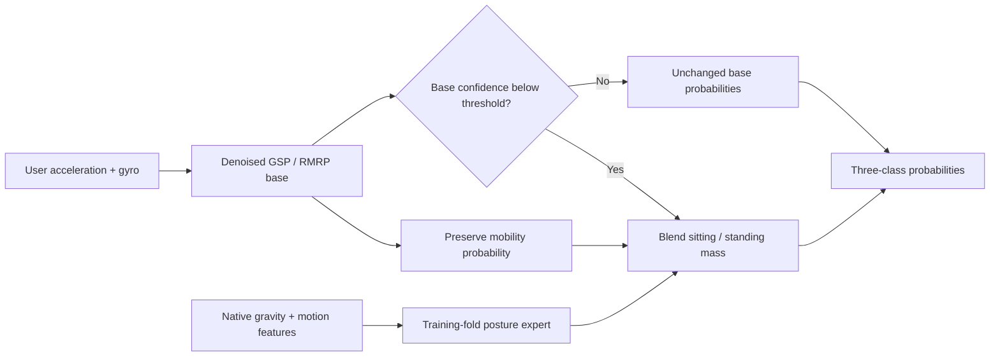

# InclusiveShift-HAR: participant-exclusive activity recognition under sensor and population shift

Research report · 20 September 2026 · Software version 0.1.7a0

## Abstract

InclusiveShift-HAR studies recognition of mobility, sitting, and standing from
wearable inertial signals, with the participant as the unit of evaluation.
The original locked six-channel target evaluation did not support the MoRe-HAR
hypothesis: Compact DANN and Compact CORAL achieved approximately 68.08% mean
participant macro-F1. Subsequent development on ten source participants produced
Confidence-Triggered Gravity Residual (CTGR), which adds native gravity and
selectively corrects uncertain posture predictions. Across five matched seeds,
CTGR improved the six-channel RMRP baseline from 83.953% to 86.540%. Strict
HERA-CTGR reached 86.849%, but its incremental advancement gates failed.
External studies exposed substantial placement and sensor-interface effects.
The contribution is an implemented method, matched ablations, and an auditable
evaluation framework; independent superiority remains unestablished.

## 1. Research questions

The experiments address three distinct questions:

1. How well do frozen inertial classifiers transfer to the original held-out
   ability-associated population?
2. Can denoising, native gravity, and selective posture correction improve
   participant-exclusive source development?
3. Which conclusions survive a change in placement, dataset, or sensor interface?

These questions have different cohorts and input budgets. Results are therefore
reported in separate comparison groups. The [experiment map](research/README.md)
indexes the earlier model families, negative trials, and follow-up studies.

Evaluation design matters in HAR: participant overlap can substantially change
the measured performance, as examined in
[How Validation Methodology Influences Human Activity Recognition Mobile Systems](https://doi.org/10.3390/s22062360).
Cross-dataset evaluation also requires explicit harmonization of units, sampling,
gravity treatment, and labels; the
[DAGHAR benchmark](https://www.nature.com/articles/s41597-024-03951-4) provides a
relevant methodological reference. Neither publication independently validates
the methods in this repository.

## 2. Data and evaluation

### 2.1 InclusiveHAR

The primary source is [InclusiveHAR v4](https://doi.org/10.17632/r78dn3f6nc.4).
The functional endpoint contains mobility, sitting, and standing. Mobility
includes manual wheelchair propulsion where the provider uses the label
`Walking`; it must not be interpreted exclusively as gait.

The original benchmark used six channels: user acceleration and rotation rate.
P1-P10 formed the source cohort, while P11-P20 were opened once under the
[locked protocol](LOCKED_PROTOCOL.md). Subsequent CTGR/HERA development uses only
the ten source participants, with 725 non-overlapping 128-sample windows,
five participant-exclusive outer folds, and four inner folds. The canonical
five-seed comparison uses seeds 11, 23, 47, 89, and 131.

Participants are separated before windowing; preprocessing, weighting, and
candidate selection use training/inner-validation partitions. The release does
not provide recoverable trial or timestamp boundaries. The released-block
protocol is participant-exclusive and raw-row-disjoint, but it cannot establish
trial-safe segmentation. Identity and sensitive metadata are not model inputs.

### 2.2 Metrics and uncertainty

The principal endpoint is mean participant macro-F1: compute macro-F1 separately
for each eligible participant, then average participants equally. Pooled
macro-F1 instead builds one confusion matrix from all scored observations.
Accuracy is the fraction of correctly classified observations. These metrics
weight participants and classes differently and are not interchangeable.

Source results also report the bottom 30% of participants, the worst participant,
class recall, negative log-likelihood (NLL), and multiclass Brier score. Differences
use aligned participant predictions and matched seeds. Participant-bootstrap
intervals are descriptive after repeated development on these people; five
training seeds do not increase the independent sample size beyond ten.

### 2.3 External studies

HARTH supplies lower-back and right-thigh accelerometry from 22 participants.
Its original study describes twelve activities and participant-held-out
evaluation. The binary posture diagnostic and the project's merged nine-class
replay are separate endpoints. See the
[HARTH dataset paper](https://pmc.ncbi.nlm.nih.gov/articles/PMC8659926/) and the
[executed replication protocol](research/HARTH_PUBLISHED_REPLICATION_V1_PROTOCOL.md).

AICOS evaluates source-frozen models using an external smartphone interface.
The latest routing comparison has 38 participants with all three primary classes
and 40,588 primary windows. Acceleration/gravity conversion from SI units to g
was corrected before that comparison. Native versus derived gravity and
unresolved logger axes/polarity still limit interpretation. Both provider splits
are consumed diagnostic evidence.

## 3. Method

### 3.1 Denoised geometric and spectral features

The Geometric Spectral Pyramid (GSP) summarizes axis statistics, covariance
geometry, rotation-related scalar features, spectra, and temporal pyramids.
The Robust Multiscale Residual Pyramid (RMRP) evaluated raw, denoised,
trend-residual, and concatenated views. All five original outer folds selected
the denoised GSP view with participant/class-weighted Extra Trees. The selected
model should therefore be described as denoised GSP; residual concatenation was
an evaluated alternative, not the source of the retained improvement.

### 3.2 Confidence-Triggered Gravity Residual

CTGR retains the six-channel base probabilities and adds a posture expert
using three native gravity channels. Its candidate views describe gravity
direction and motion relative to gravity. A confidence threshold and blending
weight, chosen in inner participant folds, determine whether to redistribute
the sitting/standing probability mass.

The mobility probability remains exactly that of the base. Confident base
outputs pass through unchanged. This restricts the intervention to uncertain
posture decisions and avoids replacing a strong mobility model globally.

### 3.3 HERA extension

Strict HERA-CTGR v1 adds top-three CTGR candidate marginalization, posture
calibration, and a gravity-gyroscope consistency veto. Its retained strict mode
uses only the current window. Participant-context controllers, label-informed
oracles, and labelled semantic gauges are separate ablations with distinct
information budgets. The [model card](MODEL_CARD_CTGR_HERA.md) and versioned
protocols specify the implementations.

## 4. Results

### 4.1 Original locked target

This historical six-channel evaluation concerns ten target participants.
It is not an evaluation of the later nine-channel CTGR/HERA models.

| Model | Mean participant macro-F1 (%) | Interpretation |
|---|---:|---|
| Compact DANN | 68.084 | Highest rounded target point estimate |
| Compact CORAL | 68.079 | Effectively tied with DANN |
| MoRe-HAR full | 63.533 | Preregistered hypothesis not supported |

Source: [locked publication report](../results/confirmatory/zero_shot_v1/publication_report_v1.json)
and [participant statistics](../results/confirmatory/zero_shot_v1/participant_statistics.json).
The target cohort is closed to subsequent model selection.

### 4.2 Matched source development

All rows below use the same 725 source windows and five seeds.

| Method | Channels | Participant macro-F1 (%) | Bottom 30% (%) | Worst participant (%) | NLL | Brier |
|---|---:|---:|---:|---:|---:|---:|
| RMRP | 6 | 83.953 | 69.941 | 54.767 | 0.36889 | 0.22512 |
| CTGR | 9 | 86.540 | **73.990** | 57.512 | 0.35426 | 0.21165 |
| Strict HERA-v1 | 9 | **86.849** | 73.933 | **58.028** | **0.34038** | **0.20303** |

CTGR gained 2.586 percentage points over RMRP and passed all nine predeclared
development advancement checks. Eight participants improved and two declined.
The descriptive paired interval was approximately [-0.05, +4.89] points.
This comparison changes both the available signal and its use; it is not an
architecture-only effect at equal sensor input.

Strict HERA gained 0.309 points over CTGR, with a descriptive paired interval of
[-0.095, +0.713] points. Its gain and bottom-tail gates failed. The highest point
estimate therefore does not establish a reliable successor.

Sources: [CTGR aggregate](../results/development/max_rnd_secondary_v1_summary.json)
and [HERA-v1 aggregate](../results/development/hera_ctgr_retrospective_v1_summary.json).

### 4.3 Mechanism and ablation evidence

| Question | Executed evidence | Supported conclusion |
|---|---|---|
| Does denoising help? | Seed-11 GSP 82.92% versus RMRP 83.79%; residual-containing views were not selected | Denoising was useful; the predeclared joint advancement threshold was not met |
| Is gravity sufficient by itself? | Standalone gravity expert 83.20% versus CTGR 86.54% in the five-seed study | Selective combination outperformed wholesale replacement in this cohort |
| Do later controllers improve HERA? | HERA-v2 86.749%; rescue routing abstained in all 25 outer-fold fits | Calibration benefits did not establish better classification |
| Does compact evidence complement HERA? | Seed-11 compact integration 86.461% versus matched HERA 86.755% | No complementary gain |
| Can one label help? | Active-hard gauge 87.256% versus 86.645% on 715 matched remaining windows | +0.611 points, confined to one participant; labelled personalization only |
| Should the confidence trigger be removed? | Seed-11 U9 minus triggered CTGR: -3.442 points on source | Reject unconditional routing; individual losses reached 35.464 points |
| Is expert complementarity available? | Label-informed HERA oracle 88.618% | Diagnostic headroom, without a deployable label-free selection rule |

These rows span different experiments and cannot be ranked or added together.
The [canonical method status](research/CANONICAL_HERA_CTGR_METHOD_STATUS.md),
[HERA-v2 report](research/HERA_CTGR_V2_RETROSPECTIVE_V1_RESULTS.md),
[gauge report](research/HERA_POSTURE_GAUGE_V1_RESULTS.md), and
[routing validation](research/CTGR_ROUTING_VALIDATION_20260919.md)
identify the corresponding controls and denominators.

### 4.4 External transfer and placement

**AICOS, 38 complete participants, three classes, frozen source models:**

| Method | Window accuracy (%) | Mean participant macro-F1 (%) | Sitting recall (%) | Standing recall (%) |
|---|---:|---:|---:|---:|
| Triggered CTGR (T9) | **76.27** | **68.972** | **57.92** | 69.96 |
| Unconditional posture routing (U9) | 73.31 | 68.926 | 45.13 | **75.60** |

U9 minus T9 was -0.046 points, with a descriptive paired interval of
[-1.712, +1.584] points. Standing improved while sitting deteriorated; the bottom
30% declined by 2.367 points. The earlier eight-person favorable result did not
repeat. Source: [fixed routing report](research/CTGR_ROUTING_VALIDATION_20260919.md).

**HARTH, 22 participants, matched binary sitting/standing diagnostic:**

| Input to rich Random Forest | Mean participant macro-F1 (%) |
|---|---:|
| Lower back | 59.037 |
| Right thigh | **97.261** |
| Both placements | 97.198 |

This is strong placement evidence within the executed protocol, not proof that
lower-back recognition is impossible. Geometry, prior correction, neural
representations, and temporal decoding did not yield an acceptable joint
improvement in posture classes and participant outcomes.

**HARTH, merged nine-class published-style replay:**

| Executed method | Sample accuracy (%) | Pooled macro-F1 (%) |
|---|---:|---:|
| Project fused Random Forest | 93.56 | 85.37 |
| Published-style XGBoost | **94.22** | **87.82** |

These are executed comparator results, not copied paper scores or a claim of
exact historical replication. Frozen CTGR/HERA was not tested in this HARTH
contract. Source: [HARTH disposition](research/RESEARCH_LANE_CLOSURE_20260919.md)
and the hash-bound entries in the
[machine-readable evidence index](../results/research/current_publication_evidence_v1.json).

## 5. Discussion and limitations

The clearest retained improvement combines useful signal information with a
restricted intervention: native gravity helps uncertain posture decisions while
the base retains mobility. The evidence does not support a general claim that
more features, larger architectures, or unconditional expert replacement improve
recognition. Participant harms and sitting/standing tradeoffs recur across
several follow-ups.

Earlier scores in the 90s came from a different UCI-HAR coursework evaluation,
with an already reused official test set. Results in the 70s also include
different baselines and labelled-target protocols. They are not successive
measurements of the same model on the same task. The [legacy audit](LEGACY_AUDIT.md)
and [evidence index](EVIDENCE_INDEX.md) preserve those distinctions.

The source cohort is small and repeatedly used. Missing trial boundaries,
unresolved external coordinates, and changes in sensor placement constrain
generalization claims. Synthetic or derived channels are transformations of
available measurements, not validation of recovered person-specific sensor
information. The repository establishes neither state of the art nor a globally
novel architecture. Its defensible contribution is the implemented CTGR mechanism,
matched development evidence, and explicit evaluation and correction record.

Further confirmation requires new information: a fresh, qualified native-nine
cohort for a frozen comparison, or the prespecified same-attachment reference
pilot. Reusing P11-P20 for successor selection is prohibited. No further
architecture sweep on the existing ten source participants is currently proposed.

## 6. Reproducibility and availability

The [reproducibility guide](REPRODUCIBILITY.md) distinguishes clone-only software
checks from analyses requiring provider data or restored prediction artifacts.
Tracked aggregate records support the tables above; large arrays, checkpoints,
and local execution archives are excluded from Git. Their absence limits
independent metric recomputation until the corresponding evidence is restored.

Use the [experiment map](research/README.md) for the full sequence of scientific
questions and the [supersession map](EVIDENCE_SUPERSESSION.md) before interpreting
older external results. Historical failures and sealed records remain preserved.
Dataset and third-party licences remain separate from the repository's
Apache-2.0 licence. Citation metadata describes the software candidate and does
not assert an existing Zenodo DOI.
