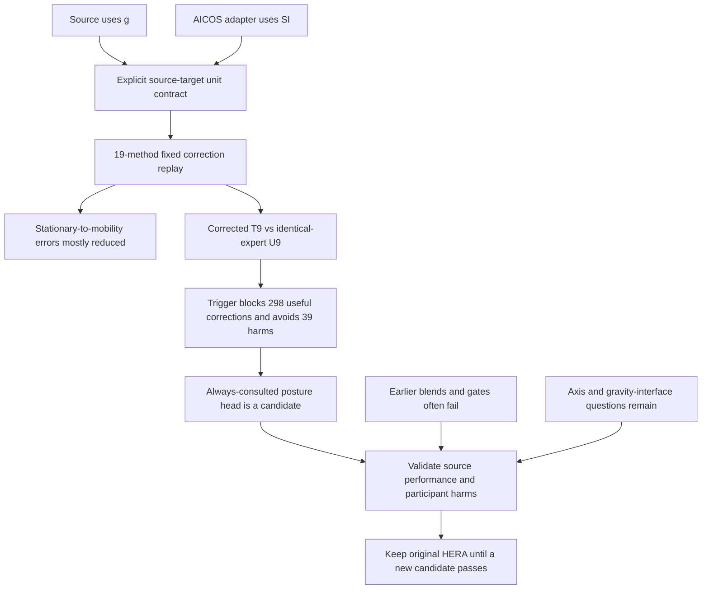

# AICOS posture review and unit-correction addendum — 2026-09-19

**Decision:** there is evidence of useful posture information already inside the
existing model. Correct the signal interface and test the existing unconditional
posture head before designing another representation. Do not promote it yet.

**Evidence status:** adaptive analysis and deterministic unit-correction replay
of an already-consumed target. No independent confirmation or novelty claim.
The original InclusiveHAR 86–87% source results are unaffected.

## A substantive implementation defect was found

The frozen InclusiveHAR source uses acceleration and native gravity in **g**.
The AICOS adapter emits linear acceleration and derived gravity in **m/s²**.
The feature and neural experiment wrappers previously passed these arrays to
g-trained models without conversion. Source gravity median norm is 1.000000;
AICOS was 9.752773 and becomes approximately 0.9945 after division by 9.80665.
Gyroscope channels stay in rad/s. Source-only normalization does not repair
this cross-domain unit mismatch.

The source YAML, materialized signals and adapter code establish this defect.
Primary documentation agrees on the differing API units:
[Apple CMAcceleration](https://developer.apple.com/documentation/coremotion/cmacceleration?language=objc)
and [Android motion sensors](https://developer.android.com/develop/sensors-and-location/sensors/sensors_motion).
The AICOS README declares SI accelerometer units, although this release also
contains magnitude heterogeneity handled by the pre-existing physical-band audit.

The old AICOS predictions remain intact. Their arithmetic was reproducible, but
the run was not a correctly unit-aligned comparison. Its claims about model
ranking, generic temporal models failing, and architecture exhaustion require
this correction. This does not invalidate separate original-source or HARTH runs.

## Re-executed comparison

All 19 methods used exactly the same 19,856 windows. The primary endpoint remains
the eight complete participants and 9,625 windows; coverage of all 21 participants
is saved separately. Four frozen estimators and both saved neural checkpoints
were reused without training. The 13 suite recipes were refit only on the same
725 source P1–P10 windows with seed 11. All source-selected recipe fields match;
only target-dependent routing diagnostics changed. No target labels entered fitting.

**pF1** means mean participant macro-F1. Accuracy and class recalls below pool
windows. Values are percentages; delta is percentage points. This distinction
matters: S75 provides 79.48% of stationary primary windows. The older and corrected
runs are paired software-condition comparisons, not two independent experiments.

| Method | Old accuracy | Corrected accuracy | Old pF1 | Corrected pF1 | Delta pF1 | Corrected sitting recall | Corrected standing recall |
|---|---:|---:|---:|---:|---:|---:|---:|
| Frozen-U9-Unconditional | 85.04 | 84.29 | 68.48 | 76.45 | +7.96 | 38.24 | 74.45 |
| Frozen-T9-CTGR | 85.51 | 81.60 | 69.13 | 71.80 | +2.67 | 34.36 | 65.24 |
| HERA-DG-v2-dual | 85.50 | 81.01 | 68.03 | 71.65 | +3.62 | 31.15 | 65.16 |
| HERA-DG-v2-core | 85.49 | 81.03 | 67.98 | 71.40 | +3.43 | 31.42 | 65.16 |
| HERA-DG-v2-full | 85.49 | 81.03 | 67.98 | 71.40 | +3.43 | 31.42 | 65.16 |
| CTGR-DG-top3-equal | 85.13 | 80.80 | 68.79 | 71.30 | +2.51 | 32.75 | 63.88 |
| HERA-DG-v2-weighted | 85.13 | 80.80 | 68.79 | 71.30 | +2.51 | 32.75 | 63.88 |
| CTGR-DG | 85.26 | 80.61 | 68.20 | 71.03 | +2.83 | 32.09 | 63.96 |
| HERA-DG-strict | 85.18 | 80.07 | 68.80 | 70.00 | +1.19 | 34.09 | 63.68 |
| Frozen-B9-PhysicsRMRP | 87.58 | 81.70 | 68.22 | 70.00 | +1.78 | 28.61 | 69.80 |
| HERA-DG-context-safe | 85.27 | 79.91 | 68.18 | 69.39 | +1.21 | 33.82 | 63.52 |
| HERA-DG-full | 85.76 | 80.14 | 67.85 | 68.90 | +1.05 | 32.22 | 65.60 |
| RMRP-DG | 84.06 | 77.30 | 64.96 | 66.77 | +1.81 | 36.10 | 52.94 |
| Frozen-B6-RMRP | 84.09 | 77.71 | 65.66 | 66.74 | +1.09 | 35.29 | 53.22 |
| CAGE-DG | 82.40 | 76.28 | 65.99 | 66.41 | +0.42 | 38.77 | 46.86 |
| XGBoost-6ch | 78.58 | 73.39 | 62.63 | 62.62 | -0.01 | 41.84 | 47.74 |
| TinyHAR-6ch-CPU | 67.52 | 68.72 | 58.22 | 60.07 | +1.86 | 57.89 | 31.40 |
| RandomForest-6ch | 75.27 | 68.59 | 57.61 | 59.78 | +2.17 | 47.06 | 34.24 |
| DeepConvLSTM-6ch-CPU | 72.17 | 65.93 | 54.92 | 52.27 | -2.65 | 93.05 | 1.04 |

Unit correction is required even when a metric gets worse. T9 stationary-to-mobility
errors fell **569 → 59**, but mobility errors rose **0 → 412** and sitting/standing
swaps rose **826 → 1,300**. T9 accuracy fell 85.51% → 81.60% while pF1 rose
69.13% → 71.80%. The error decomposition, not a selected headline metric, is the finding.
DeepConvLSTM still collapses standing (1.04% recall); the correction does not solve
the whole transfer problem. Every participant effect and uncertainty interval is
retained in the sealed result, including negative changes.

## A precise architecture mechanism is visible

Compare **corrected T9 versus corrected U9**, using identical B6, gravity expert
and weight. The selected expert is `dual_gsp__extra_trees_leaf3`, weight 1.0.
T9 consults it only when `max(base_probability) < 0.60`; U9 always uses its posture
distribution. This controlled intervention isolates the trigger on these inputs.

| Matched corrected comparison | T9: confidence trigger | U9: unconditional posture expert |
|---|---:|---:|
| Accuracy | 81.60% | 84.29% |
| Mean participant macro-F1 | 71.80% | 76.45% |
| Pooled sitting recall | 34.36% | 38.24% |
| Pooled standing recall | 65.24% | 74.45% |
| Pooled mobility recall | 93.54% | 93.54% |
| Mean participant sitting recall | 51.60% | 59.80% |
| Mean participant standing recall | 78.04% | 82.98% |

U9 repairs 298 decisions and spoils 39: sitting 45 repaired/16 spoiled, standing
253 repaired/23 spoiled. All 337 changed decisions had been excluded by T9’s
confidence trigger. Mobility probability agrees to machine precision and every
mobility hard decision is identical on this replay. Preserving mobility probability
does not mathematically guarantee identical argmax decisions on arbitrary future inputs.

The paired pF1 gain is **+4.649 pp**, with a descriptive 95% participant bootstrap
interval **[+0.484, +9.621] pp**, seven wins and one harm. S100 loses **4.954 pp**.
The interval is post hoc on eight people and does not establish a population result.
This supports a routing failure in this transfer setting; it does not prove the
original source-trained CTGR trigger is globally inferior or that posture is solved.

## Connection to the existing knowledge tree

| Earlier evidence | What remains useful | Consequence now |
|---|---|---|
| RMRP 83.953% → CTGR 86.540%, five-seed source development | Selective gravity contains useful posture information | Retain the trained gravity expert and original source control |
| HERA-v1 86.849% five-seed mean; 86.755% at seed 11 | Highest source point estimate, incremental gate not passed | Preserve it; do not replace it with an AICOS score |
| Compact scalar gravity +0.764 pp over A2, but −0.294 pp when blended with HERA | A useful feature alone need not add complementary information to HERA | Another blind blend is unsupported |
| HERA-v2 routing mostly disabled/unsafe; calibration did not improve class ranking | A new learned gate can fail on limited source people | Do not start another gate search on these same outcomes |
| Label-assisted semantic gauge +0.611 pp on matched remaining windows, only one person changed | Some ambiguity can be resolved with labels | Keep personalization separate from zero-query performance |
| HARTH thigh ≈97.26%, back ≈59.04% on its binary endpoint | Sensor placement can limit information | Retain as contextual evidence; do not transplant its conclusion to this unit-mismatched AICOS run |
| New corrected T9/U9 intervention | Existing gravity head repairs confident base errors | Test trigger removal before building a new encoder |

## Smallest justified next experiment — proposed, not executed here

1. Finish **interface qualification** first. The dimensional defect is repaired.
   Verify logger axis/polarity conventions from provenance or known-orientation
   fixtures; do not choose signs by target F1. Apple and Android document different
   acceleration conventions ([Apple's example](https://developer.apple.com/tutorials/sample-apps/seismometer),
   [Android's sensor definition](https://developer.android.com/develop/sensors-and-location/sensors/sensors_motion)),
   and AICOS README does not establish its full logger
   transformation. Keep native versus low-pass-derived gravity explicit. Audit the
   unexecuted native-nine confirmation interface too: its present YAML declares
   SI inputs for the g-trained frozen predictor. Do not publish that interface as qualified.
2. Make **one fixed routing comparison**, using existing data: B6, B9, original T9,
   and U9. The candidate is the existing always-consulted posture head, not a new
   encoder or another mixture search. Keep the same base/expert bytes, views, weights
   and source selection within each comparison; change only the consultation rule.
   Use the five original source participant folds, seed 11, and the original nested
   selection rules. Assess AICOS provider development folds 1–5 separately with
   source-only frozen predictors. Their archive is already local. Score every
   predeclared complete participant and retain incomplete-person coverage separately.
   No training on AICOS labels and no use of the consumed provider test to choose
   a threshold, model or sign. Source outcomes remain repeatedly used development evidence.
3. Nominate a portable version only if this new development protocol shows a
   practically useful gain (proposed ≥2 pp pF1, positive paired 95% interval),
   no sitting or standing recall regression, no mobility recall loss beyond 1 pp,
   no participant loss beyond 3 pp, and no bottom-tail regression. Require source
   non-regression against matched T9; keep matched HERA results alongside it.
   These are prospective nomination criteria, not changes to historical locks.
   The current S100 harm already prevents an unconditional broad deployment claim.
4. Run this finite matrix once. If it fails, retain HERA/CTGR and the corrected
   external diagnostic, and finalize the repository with the limitations stated.
   Do not open another gate/weight/encoder sweep. A passing development result
   still needs an independent cohort before a generalization/superiority claim.

The mathematical candidate keeps the base mobility mass pM and uses the existing
posture distribution q: **p = [pM, (1−pM)q_sit, (1−pM)q_stand]**.
This is already implemented as U9; the remaining question is whether its broader
use is justified across people and interfaces. No novelty claim follows from
removing a gate or repairing units.

## Validation and artifacts

The complete correction replay took **196.09 seconds**. Four frozen
predictions and DeepConvLSTM reproduced the old probabilities exactly; TinyHAR’s
maximum difference was 2.3842e-7. All 19 reports were independently recomputed
from saved predictions. Old and new artifact manifests passed integrity checks.
The old checkpoints, raw data, window IDs and source recipes were preserved.
Adapter/external-data tests: **18 passed**; changed modules passed Ruff and mypy.

Repository-relative evidence:

- `.audit/aicos_units_review_20260919-001/PROTOCOL.md` — fixed pre-score correction protocol;
- `.audit/aicos_units_review_20260919-001/replay.py` — exact executed controller;
- `.audit/aicos_units_review_20260919-001/input_audit.json` — measured units and archive identity;
- `.audit/aicos_units_review_20260919-001/execution_provenance.json` — source and code hashes, branch/commit, checkpoint receipts;
- `.audit/aicos_units_review_20260919-001/predictions.npz` — all 19 corrected probability matrices;
- `.audit/aicos_units_review_20260919-001/result.json` — all before/after metrics, paired intervals, participant harms and coverage;
- `.audit/aicos_units_review_20260919-001/diagnostics.json` — class errors, individual recalls/AUC and device/position strata;
- `.audit/aicos_units_review_20260919-001/completion_manifest.json` — sealed correction-run hashes;
- `.audit/aicos_posture_routing_review_20260919-001/routing_diagnostic.json` — matched trigger intervention;
- `.audit/aicos_posture_routing_review_20260919-001/validation.json` — independent numerical and integrity replay;
- `.audit/aicos_posture_routing_review_20260919-001/knowledge_tree_delta.json` — append-only machine-readable evidence graph.
