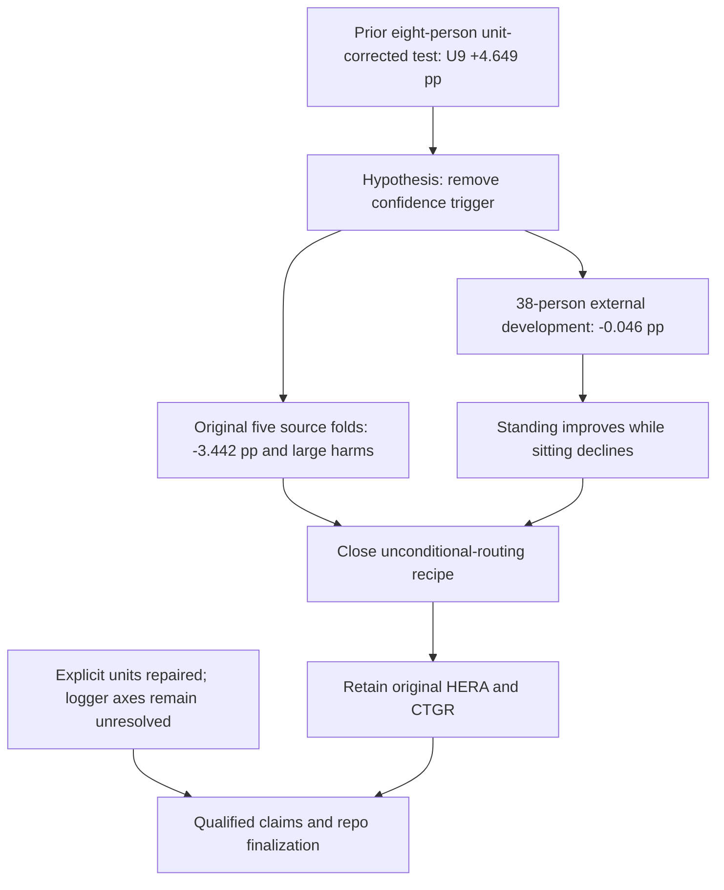

# Fixed routing validation — executed 2026-09-19

**Decision: retain original HERA/CTGR; close this unconditional-routing recipe.**

The complete authorized matrix ran: five original source participant folds and
four frozen methods on AICOS provider development folds 1–5. The earlier
eight-person provider-test gain did not repeat on the 38 complete development
participants. Source performance also regressed. No candidate was promoted.

**Scope:** adaptive development, seed 11; no independent confirmation, no P11–P20
evaluation, no provider-test rescore, no new external fits or additional seeds.
AICOS remains conditional on unresolved logger axis/polarity provenance.

## Comparable results

Source: 725 windows, ten participants, five original outer folds. T9 uses the
original nested-selected expert and weight in each fold; U9 changes only the
consultation rule. HERA is the saved, aligned seed-11 reference—not a new refit.
B9 was fit once per outer fold using the frozen source-finalization recipe.

| Source method | Accuracy % | Mean participant macro-F1 % | Sitting recall % | Standing recall % |
|---|---:|---:|---:|---:|
| B6 | 84.41 | 83.79 | 70.94 | 83.69 |
| B9 | 82.21 | 78.65 | 75.21 | 72.53 |
| T9 | 86.90 | 86.47 | 77.78 | 83.69 |
| U9 | 85.93 | 83.03 | 80.34 | 78.11 |
| HERA-v1-strict | 87.03 | 86.75 | 78.21 | 84.55 |

AICOS development: 59,753 qualified windows across 80 participants; primary
endpoint 40,588 windows from 38 participants with all three classes. All-person
coverage reports include the other 42 participants separately. The provider’s
84-person development roster was frozen before windowing and is disjoint from
provider test. Accuracy and recalls below pool windows; primary F1 averages people.

| External method | Accuracy % | Mean participant macro-F1 % | Sitting recall % | Standing recall % |
|---|---:|---:|---:|---:|
| B6 | 76.28 | 67.42 | 64.60 | 62.06 |
| B9 | 68.10 | 64.64 | 34.87 | 69.60 |
| T9 | 76.27 | 68.97 | 57.92 | 69.96 |
| U9 | 73.31 | 68.93 | 45.13 | 75.60 |

## Uncertainty and harms

| U9 minus T9 | Source | AICOS development |
|---|---:|---:|
| Mean participant F1 change | -3.442 pp | -0.046 pp |
| Paired 95% interval | [-14.159, +5.643] pp | [-1.712, +1.584] pp |
| Wins / harms / ties | 5 / 2 / 3 | 17 / 16 / 5 |
| Worst paired loss | -35.464 pp | -16.605 pp |
| Bottom-30% change | -12.637 pp | -2.367 pp |

Source P4 lost 35.464 pp and P6 lost 32.343 pp. External S49 lost 16.605 pp;
S43 lost 12.281 pp. All individual deltas are in result.json. Confidence intervals
use 10,000 paired participant bootstrap draws with RNG 20260919 and are descriptive.

Source sitting recall rose 2.564 pp but standing fell 5.579 pp. On AICOS,
standing rose 5.634 pp but sitting fell 12.787 pp. Equal-participant recalls show
the same tradeoff. Mobility probability is preserved by composition; the
validation record also checks hard mobility decisions on the actual windows.

The source non-regression gate, external practical-gain gate and complete
interface-qualification gate all failed. No thresholds, blend weights, signs
or architectures were changed after seeing these outcomes.

## Interface audit and engineering repair

The [provider’s public harmonization repository](https://github.com/fraunhoferportugal/aicoshar-parser-suite)
confirms SI units but does not supply the AICOS acquisition logger’s axis/sign
mapping. Its source commit and files were preserved under preflight/. Signed
features are present in GSP, so invariance cannot be assumed. AICOS acceleration
and gravity were converted to g; released signs were retained, exactly as
predeclared. No metric-based sign choice or polarity sweep was performed.

Native source gravity and 0.30 Hz low-pass-derived AICOS gravity were kept in
separate evidence lanes. AICOS is a conditional transfer diagnostic, not the
fresh native-nine confirmation cohort. Resolving the logger convention remains
a publication/transfer-claim limitation; it does not erase the valid source failure.

The unused ctgr_native9_confirmation entry point had the same dimensional bug:
it accepted SI cohort arrays and passed them directly to the g-trained model.
It now converts acceleration/gravity explicitly before both normal inference
and missing-gravity B6 fallback, preserves rad/s, and records the conversion
in the prediction seal. Tests cover physically equivalent SI/g inputs, gyro
preservation, unsupported-unit rejection and the real prediction entry path.
This fix does not qualify an unrecorded cohort or resolve coordinate conventions.

## Knowledge-tree update

The gravity expert contains useful information, but using it everywhere is not
a portable improvement. The source trigger protects participants; the earlier
external gain was cohort-dependent. This trial adds no verified successor or
novel architecture. Preserve the existing method and finalize the repository
with these limitations and reproducible negative evidence. No further automatic
routing, encoder, seed or dataset campaign is justified by this result.

## Execution and exact artifacts

Complete experiment runtime: **161.81 seconds**. Exactly five
new B9 source fits; zero new external fits. Original source B6/T9/expert replay
maximum absolute probability error: **2.22e-16**.
27 tests passed; Ruff and mypy passed. A separate sklearn metric calculation
reproduced all nine primary method reports and both paired intervals. Source
partitions, provider participant separation, original input hashes, checkpoints
and all sealed artifact hashes were verified. Existing evidence was preserved.

Repository-relative run directory:

`.audit/ctgr_routing_validation/ctgr-routing-validation-seed11-20260919-001/`

- `PROTOCOL.md`, `execution_freeze.json`, `snapshots/`: fixed plan and code/input bindings;
- `preflight/interface_qualification.json`: qualified facts and unresolved logger contract;
- `source/source_cv_01/` through `source_cv_05/`: all five fit receipts, B9 models and fold predictions;
- `source/predictions.npz`, `source/result.json`: aligned source comparison and HERA reference;
- `external/prewindow_partition.json`, `external/data_qualification.json`: roster and exclusions;
- `external/predictions.npz`, `external/prediction_seal.json`: four source-only frozen outputs;
- `external/result.json`, `result.json`: complete and coverage metrics, all harms, gates and disposition;
- `completion_manifest.json`: sealed run inventory.

Separate review directory:

`.audit/ctgr_routing_validation_review_20260919-001/`

- `validation.json`: metric, split, checkpoint and manifest checks;
- `knowledge_tree_delta.json`: append-only machine-readable findings;
- `worker_shutdown.json`: task-owned process shutdown receipt;
- `completion_manifest.json`: final review/document hashes.
