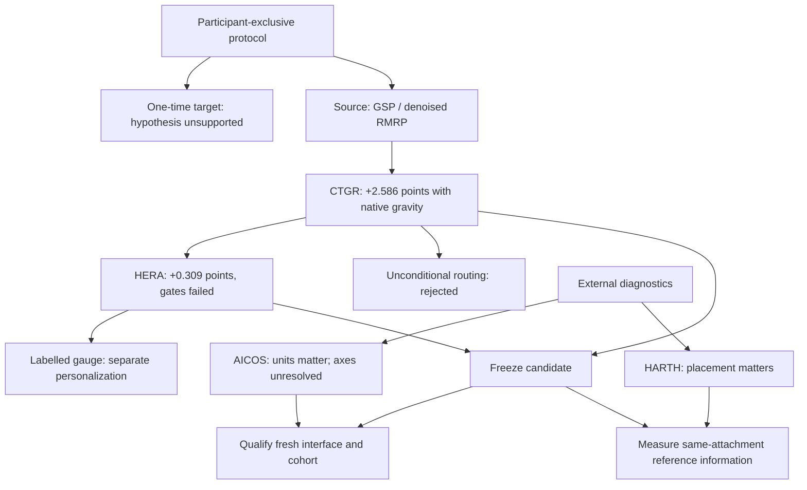

# Experiment map

Experiments are grouped by scientific question. Start with the
[research report](../RESEARCH_REPORT.md) for methods and comparable tables.
This index is a reading guide, not a leaderboard or a new result. Frozen
protocols, failed attempts, and historical paths remain preserved.

## 1. Establish the evaluation contract

| Study | Purpose and outcome | Record |
|---|---|---|
| Legacy UCI-HAR audit | Reconstruct coursework results; identify consumed test evidence and invalid comparisons with later cohorts | [Legacy audit](../LEGACY_AUDIT.md) |
| Participant-exclusive benchmark | Freeze ontology, source/target participants, endpoints, and one-time target access | [Locked protocol](../LOCKED_PROTOCOL.md), [benchmark card](../BENCHMARK_CARD.md) |
| Original target comparison | Compact DANN and CORAL effectively tied; MoRe-HAR hypothesis unsupported | [Target report](../../results/confirmatory/zero_shot_v1/publication_report_v1.json) |
| Post-confirmatory analyses | Within-group training, few-person inclusion, sensor stress, unit sensitivity, and adapted external methods answer separate secondary questions | [Results inventory](../../results/README.md) |

## 2. Improve the source model

| Family | What was learned | Record |
|---|---|---|
| HYDRA, MultiRocket, QUANT, RIST, spectral features, neural controls and expert stacking | Strict source comparisons favored GSP/RMRP; outer-fold early-stopping diagnostics are excluded from the primary comparison | [FuSE/ReFrame report](FUSE_REFRAME_V2_RESEARCH_REPORT.md) |
| GSP and RMRP | Denoised GSP was selected in all five folds; noise tolerance improved, temporal-gap robustness weakened, and the joint advancement gate failed | [FuSE/ReFrame report](FUSE_REFRAME_V2_RESEARCH_REPORT.md) |
| CTGR | Native gravity plus confidence-triggered posture correction improved matched five-seed development over RMRP; nine advancement checks passed | [Protocol](CONFIDENCE_TRIGGERED_GRAVITY_RESIDUAL_PROTOCOL.md), [results](MAX_RND_SECONDARY_RESULTS.md) |
| CAGE-HAR | The retrospective extension did not pass advancement | [Results](CAGE_HAR_RETROSPECTIVE_V1_RESULTS.md) |
| HERA-v1 | Strict window-only variant had the highest point estimate; incremental gain and lower-tail gates failed | [Results](HERA_CTGR_RETROSPECTIVE_V1_RESULTS.md) |
| HERA-v2 | Calibration improved; rescue routing remained inactive in all outer fits; classification did not advance | [Results](HERA_CTGR_V2_RETROSPECTIVE_V1_RESULTS.md) |
| Fixed GSP/gravity/estimator ablation (Round A) | All six cells completed; flat gravity and learner substitutions failed to exceed aligned CTGR/HERA controls | [Complete table](../RESEARCH_REPORT.md#43-fixed-source-ablation), [metric audit](REPORTED_METRICS_AUDIT_20260920.md) |
| Microstate posture graph | The graph extension did not justify replacing the retained source model | [MPG results](MPG_RMRP_V1_RESULTS.md) |
| Compact evidence integration and gravity-invariant follow-up | Compact integration regressed against matched HERA; current evidence does not promote these variants | [Compact protocol](HERA_COMPACT_EVIDENCE_INTEGRATION_V1_PROTOCOL.md), [gravity protocol](GRAVITY_INVARIANT_FOLLOWUP_V1_PROTOCOL.md), [canonical status](CANONICAL_HERA_CTGR_METHOD_STATUS.md) |
| Fixed unconditional routing U9 | Source regression and participant harms; larger AICOS comparison did not reproduce the earlier small-cohort gain | [Routing validation](CTGR_ROUTING_VALIDATION_20260919.md) |

Five-seed aggregates, single-seed follow-ups, and exploratory controls are
separate comparison groups. Historical terms such as “breakthrough” in early
reports are interpreted through the current evidence and advancement gates,
not as independent confirmation or a novelty claim.

## 3. Change the information available

| Family | Information budget and interpretation | Record |
|---|---|---|
| Semantic Anchor Reconciliation and Active Semantic-Gauge Sentinel | Labelled personalization; anchor windows excluded from evaluation | [FuSE/ReFrame report](FUSE_REFRAME_V2_RESEARCH_REPORT.md), [secondary results](MAX_RND_SECONDARY_RESULTS.md) |
| HERA posture gauge | One query per participant; observed gain confined to one participant on matched remaining windows | [Gauge results](HERA_POSTURE_GAUGE_V1_RESULTS.md) |
| Provenance-mask reconstruction | Small corruption-specific robustness effect | [Secondary results](MAX_RND_SECONDARY_RESULTS.md) |
| Physical-reference and same-attachment studies | Geometric identifiability and software contracts; no prospective human pilot result | [Signal analysis](PHYSICAL_INFORMATION_SIGNAL_ANALYSIS_V1.md), [reference protocol](SAME_ATTACHMENT_DIRECTIONAL_REFERENCE_GEOMETRY_V1_PROTOCOL.md) |

## 4. Evaluate external data and sensing assumptions

| Study | Current interpretation | Record |
|---|---|---|
| External FoG and cross-dataset sequence | Retain annotation, session-grid, context-population, and split-order corrections; earlier versions are superseded | [Correction index](../EVIDENCE_SUPERSESSION.md), [v4 evidence](../../results/research/cross_dataset_har_v4/) |
| FoG feature/weight, decision-rule, spatial, motion-factorization, pretrained-context and compact-readout probes | Distinct mechanism diagnostics with their own protocols; not interchangeable with the InclusiveHAR posture endpoint | [Factorial](FOG_RF_FEATURE_WEIGHT_FACTORIAL_V1_PROTOCOL.md), [decision rule](FOG_DECISION_RULE_PROBE_V1_PROTOCOL.md), [spatial probe](FOG_SPATIAL_INFORMATION_PROBE_V1_PROTOCOL.md), [factorization](FOG_MOTION_FACTORIZATION_V1_PROTOCOL.md), [pretrained context](FOG_PRETRAINED_OPTIONAL_CONTEXT_V1_PROTOCOL.md), [compact readout](FOG_COMPACT_JOINT_READOUT_V1_PROTOCOL.md) |
| HARTH placement comparison | Thigh reached 99.723% accuracy and 97.261% participant macro-F1 over five participant folds; fusion added no measured benefit | [Metric audit](REPORTED_METRICS_AUDIT_20260920.md), [lane closure](RESEARCH_LANE_CLOSURE_20260919.md) |
| HARTH CRSP, SAGE-X, gravity hierarchy and temporal/standing gates | No reliable simultaneous posture and participant improvement supporting promotion | [CRSP](HARTH_CRSP_BACK_V1_PROTOCOL.md), [SAGE-X](HARTH_SAGE_X_V2_PROTOCOL.md), [hierarchy](HARTH_GRAVITY_HIERARCHY_V1_PROTOCOL.md), [standing gate](HARTH_STANDING_OBSERVABILITY_GATE_V1_PROTOCOL.md) |
| HARTH published-style replay | Executed XGBoost exceeded project fused RF on the merged nine-class endpoint | [Protocol](HARTH_PUBLISHED_REPLICATION_V1_PROTOCOL.md), [disposition](RESEARCH_LANE_CLOSURE_20260919.md) |
| AICOS zero-shot and unit review | Initial unit-mismatched rankings are superseded; axes/polarity remain unresolved | [Corrected review](AICOS_POSTURE_REVIEW_20260919.md) |
| AICOS fixed routing validation | 38 complete participants; U9 did not improve the mean and worsened sitting and lower-tail outcomes | [Routing report](CTGR_ROUTING_VALIDATION_20260919.md) |

## 5. Current disposition

Retain CTGR as the primary source-development control and strict HERA-v1 as
the highest point-estimate ablation. The next performance study requires a fresh
qualified cohort or new measured reference information. The implemented
[native-nine confirmation workflow](CTGR_NATIVE9_CONFIRMATION_V1_PROTOCOL.md)
has no fresh-cohort result. The six-wearer same-attachment pilot is prospective.

The [canonical status](CANONICAL_HERA_CTGR_METHOD_STATUS.md),
[research disposition](CURRENT_RESEARCH_DISPOSITION_20260919.md), and
[assessment](EXPERT_FINALIZATION_ASSESSMENT_20260920.md) explain this decision.
The [supersession map](../EVIDENCE_SUPERSESSION.md) governs interpretation of
older documentation after a correction.

Arrows express the research sequence or resulting decisions, not causal effects
estimated across datasets.
