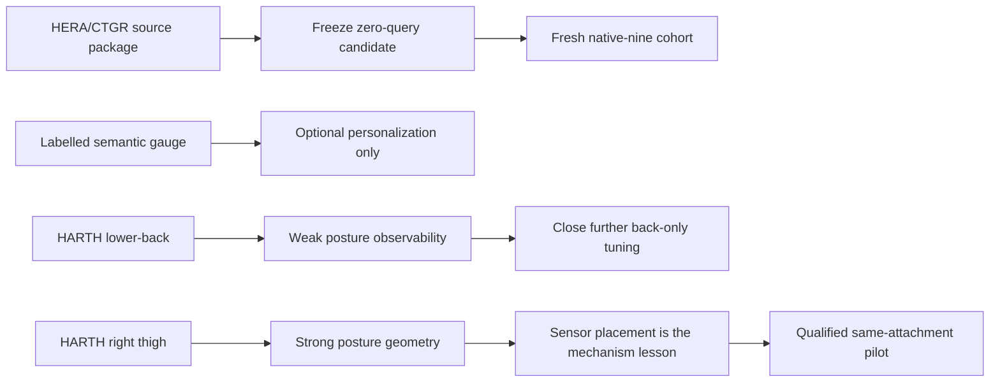

# Research-lane closure and external-diagnostic disposition

**Decision date:** 2026-09-19
**Decision:** freeze the current original-HAR development package; close further
HARTH architecture tuning; retain HARTH as external mechanism evidence.

## Lanes and claim boundaries

| Lane | What it answered | Disposition | Prohibited inference |
|---|---|---|---|
| Original InclusiveHAR, zero-query | CTGR is the robust matched improvement; HERA-v1 is the highest source-development point estimate | freeze as a new-cohort candidate | independent superiority or confirmation |
| HERA labelled semantic gauge | A small labelled query can detect a P10-like posture-column ambiguity | retain as separate personalization diagnostic | a zero-query HERA gain |
| HARTH binary sitting/standing | Right-thigh acceleration supports strong posture classification; lower-back acceleration is substantially weaker under the evaluated protocol | retain as sensor-placement evidence; close back-only tuning | that HERA will reproduce HARTH results, lower-back recognition is impossible, or a synthetic gyro supplies measured motion |
| HARTH published 9/12-class replication | The project fused RF is competitive but below executed published XGBoost under this diagnostic contract | retain as reproducible external comparator | an all-published-method superiority claim |
| Same-attachment directional reference | Algebra and software contracts are qualified on fixtures | retain as a prospective mechanism | human performance or novelty evidence before recordings |

## HARTH closure record

The completed HARTH binary endpoint provides a matched sensor-placement comparison.
On the identical 22-participant binary protocol, lower-back
rich RF achieved 0.59037 participant macro-F1, while right-thigh rich RF achieved
0.97261. Fusing the two achieved 0.97198, with no measured benefit from adding
the back channel in this experiment. The train-only confidence gate reached 0.86263
but traded precision for standing recall; the thigh-only model is the simpler
survivor.

Back-only extensions did not remove this bottleneck:

- SAGE-X neural and self-supervised arms reached roughly 0.396--0.464
  participant macro-F1 without a reliable improvement in the standing/sitting
  distinction.
- Gravity geometry was neutral (0.58904 versus 0.59037); prior correction was
  harmful (0.44531); the temporal decoder reached 0.61600 but reduced standing
  recall and failed its uncertainty and harm gates.
- In the published-protocol replay, project fused RF reached 0.8537 merged
  nine-class macro-F1, below the executed published XGBoost at 0.8782. Binary
  thigh results and nine/twelve-class results are not directly comparable.

No further HARTH feature, SSL, decoder, synthetic-gyro, or back-only architecture
trial is justified without a new sensor/interface question. A generated channel
cannot validate recovery of placement-specific information absent from the
recording.

## Knowledge-tree delta

The sealed 2026-09-13 review remains immutable. Its later unsealed graph update
already records the HARTH SAGE-X, gravity-hierarchy, and standing-observability
nodes. This closure adds the following conclusions to the authoritative current
interpretation without changing any historical result:

The primary graph and its historical manifest have intentionally not been
rewritten: their 2026-09-13 hashes document a sealed review. This document,
the dated tree-update records, and the result artifacts form the current
post-seal supplement. A future release manifest must hash both the sealed review
and this supplement.

## Repository completion gate

Before any local commit or external release claim:

1. Validate the full source and test tree in the locked CPU plus research
   environment.
2. Keep the temporary HARTH reproduction source files out of commits until their
   third-party provenance and licence status are recorded; retain their hashes
   in the corresponding audit receipt.
3. Commit first-party source, tests, configurations, protocols, and these two
   closure documents in logical changesets after the validation gate passes.
4. Preserve `.audit/`, raw archives, failed attempts, predictions, and source
   receipts unchanged.

## Evidence

- `.audit/harth_sage_x_20260918/ANALYSIS.json`
- `.audit/harth_gravity_hierarchy_20260918/run-003/REPORT.md`
- `.audit/harth_standing_observability_20260918/run-001/REPORT.md`
- `.audit/harth_published_replication_20260918/run-007/REPORT.md`
- `.audit/harth_published_replication_20260918/TEMPORARY_REFERENCE_MATERIALS_RECEIPT_20260919.json`
- `.audit/research_direction_20260913-001/KNOWLEDGE_TREE.json`
- `.audit/research_direction_20260913-001/KNOWLEDGE_TREE_UPDATE_HERA_POSTURE_GAUGE_20260916.md`
